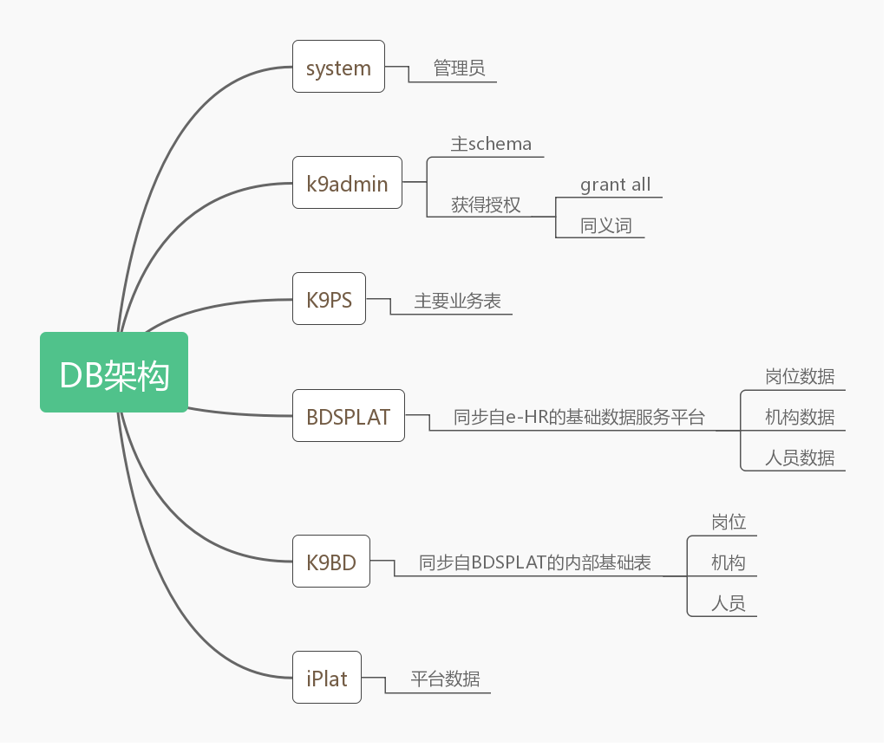

# Day21 - 06.03

### 工作内容

进一步明确重要的数据表

```plsql
bdsplat.t_bds_emp_base_info
bdsplat.t_bds_emp_base_info_bj
bdsplat.t_bds_org_base_info
bdsplat.t_bds_post_base_info
bdsplat.t_bds_post_base_info_bj
bdsplat.t_bds_post_directory
bdsplat.t_bds_post_job_type
bdsplat.t_bds_post_point_directory


--iplat
iplat.tecaf01

--k9bd
k9bd.t_bd_position
k9bd.t_bd_employee_base
k9bd.t_bd_emp_assignation
k9bd.t_bd_organization
k9bd.t_bd_org_relation
k9bd.t_bd_job_type

--k9ps
k9ps.t_ps_job_specification
k9ps.t_ps_job_specification_cl
k9ps.t_ps_job_specification_field

fun_hrog_getcommpany_orgcode
fun_hrog_getdepte_orgcode

select bdsplat.fun_hrog_org_fullname('BSZG') from dual;
```

明确了系统数据库的设计思路:



